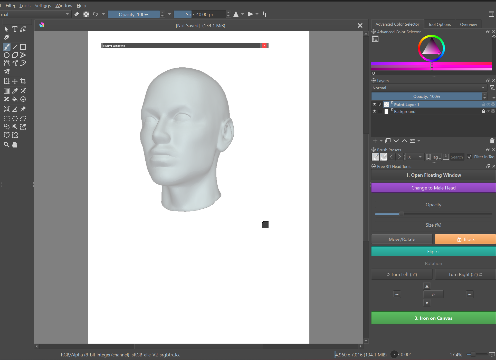

# 3D Human Head Reference for Krita

A simple but useful plugin to display rotatable 3D head references directly inside Krita using **PyQt5**.

## 📖 About the Project

I created this tool because I wanted a quick way to have head references without leaving Krita. 

**Honest Note from the Developer:** I don't know much about Blender/3D modeling, so I looked for a practical solution that works smoothly within Krita's interface. Instead of a heavy 3D engine, this plugin uses **pre-rendered PNG sequences**.

This makes the plugin **lightweight and compatible** with Krita's PyQt5 system without issues. While the mobility isn't infinite (since they are pre-rendered frames), it is optimized for the basics and helps you get the angle you need quickly.

### Included Models
The plugin comes with two folders containing the pre-rendered heads:
* 📂 **`modelo_matrix_480`**: The standard **Female** head.
* 📂 **`modelo_matrix_480_2`**: The standard **Male** head.

---

## 🛠 Installation (Super Obvious Steps)

Please follow these steps carefully to make sure the images load correctly.

1.  **Download** the repository/plugin as a ZIP file.
2.  **Open Krita** and go to `Settings` > `Manage Resources` > `Open Resource Folder`.
3.  Navigate to the `pykrita` folder.
4.  **Extract/Paste** the plugin folder there.
5.  🚨 **CRITICAL STEP:** Make sure the folders named `modelo_matrix_480` and `modelo_matrix_480_2` are inside the plugin folder within `pykrita`. If these folders are missing or misplaced, the heads won't show up!
6.  **Restart Krita**.
7.  Enable the plugin in `Settings` > `Configure Krita` > `Python Plugin Manager`.

---

## 🚧 Why no Manga Heads?

I didn't include Manga/Anime styled heads in this version because I didn't have enough time, and I haven't seen enough support or demand from the community for it yet.

**If this tool is useful to you and you want to see Manga heads added, let me know!** If I see support, I will add them in a future update.

---

## 🔮 Coming Soon

I like doing many things and working on different tools. I am currently working on a **3D Mannequin Plugin** for Krita. Stay tuned!

---

## 💖 Support & License

This project is open-source under the **MIT License**. You are free to use it and modify it.

I just want to help the community. However, if you want to support my work or buy me a coffee, donations are greatly appreciated!

| Support the Project |
| :---: |
|  |

*Special thanks to the Krita Reddit community for the inspiration and feedback. Any questions, you know where to find me on Reddit!*
